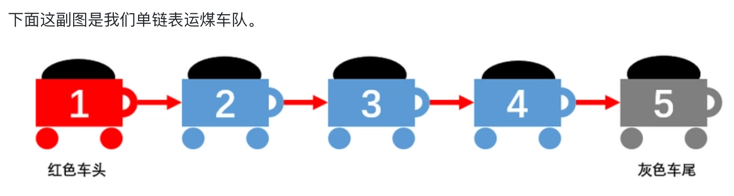
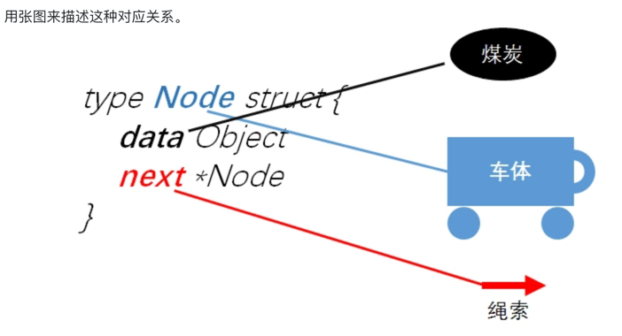

[toc]

## 链表概念👇
____
```
链表是一种物理存储单元上非连续、非顺序的存储结构,
数据元素的逻辑顺序是通过链表中的指针链接次序实现的

链表由一系列结点（链表中每一个元素称为结点）组成，结点可以在运行时动态生成。
每个结点包括两个部分：一个是存储数据元素的数据域，另一个是存储下一个结点地址的指针域。

链表允许插入和移除表上任意位置上的结点，但是不允许随机存取。

```


##### 链表有三种类型：单向链表、双向链表以及循环链表。

## 单向链表👇
____
**下面这副图是单链表运煤车队**。

```
每节车厢 就是单链表里的元素
每节车厢里的煤炭 就是元素中保存的数据
前后两节车厢 通过锁链相连
第一节车厢没有任何车厢拉它，就叫它车头，第五节车厢没有拉其他车厢，我们称为车尾
作为单链表运煤车，从1号车厢开始，每节车厢都知道后面拉着哪一节车厢，却不知道前面是哪节车厢拉的自己

作为单链表它最大的特点就是能随意增加车队的长度，也能随意减少车队的长度
这是比数组公交车最大的优点
```

### 单结点👇

```
每节车厢都由车体、绳索和煤炭构成
在Go语言中表示这种自定义组合体的类型就是结构，
当然为了通用性，这里要把车厢转换成节点也就是元素，煤炭转换成数据，绳索转换成指针。
```

```
//样例结构体：
type Node struct {  // 车体
    data Object  // 煤炭
    next *Node   // 绳索
}
```


```
当然Go里是没有Java里的Object类型的，所以我们就自己定义了一个

type Object interface{}

这里结构体：
Node表示车厢，
data表示煤炭用Object类型，
next是牵着下节车厢的绳索，用指针表示
对于车厢来说，除了放煤炭外，还能放瓜果、衣物、饭菜等等，所以这里data的类型必须通用

```

### 链表使用👇
```
type Node struct {  // 车体
    data Object  // 煤炭
    next *Node   // 绳索
}

type List struct {
    size uint64 // 车辆数量
    head *Node  // 车头
    tail *Node  // 车尾
}
```

#### 初始化👇
```
//第一步就是组装单链表车队，这就是初始化
//不过开始的时候车队是个空壳，一个车厢没有

func (list *List) Init() {
    (*list).size = 0    // 此时链表是空的
    (*list).head = nil  // 没有车头
    (*list).tail = nil  // 没有车尾
}
```

#### 添加元素👇
```
func (list *List) Append(node *Node) bool {
    if node == nil {
        return false
    }
    
    (*node).next = nil
    // 将新元素放入单链表中
    if (*list).size == 0 { 
        (*list).head = node  
    } else { 
        oldTail := (*list).tail
        (*oldTail).next = node  
    }

    // 调整尾部位置，及链表元素数量
    (*list).tail = node // node成为新的尾部  
    (*list).size++      // 元素数量增加

    return true
}
```

#### 插入元素👇
```
func (list List) Insert(node *Node) bool {
    // 空的节点、索引超出范围和空链表都无法做插入操作
    if node == nil || i > (*list).size || (*list).size == 0 {
        return false
    }

    if i == 0 { // 直接排第一，也就领导小舅子才可以
        (*node).next = (*list).head
        (*list).head = node
    } else {
        // 找到前一个元素
        preItem := (*list).head
        for j := 1 ; j < i; j++ { // 数前面i个元素
            preItem = (*preItem).next
        }
        // 原来元素放到新元素后面,新元素放到前一个元素后面
        (*node).next = (*preItem).next
        (*preItem).next = preItem
    }

        (*list).size++ 

        return true
}
```

#### 删除元素👇
```
func (list *List) Remove(i uint, node *Node) bool {
    if i >= (*list).size {
        return false
    }
    
    if i == 0 { // 删除头部
        node = (*list).head
        (*list).head = (*node).next
        if (*list).size == 1 { // 如果只有一个元素，那尾部也要调整
            (*list).tail = nil
        }
    } else {
        preItem := (*list).head
        for j := 1; j < i; j++ {
            preItem = (*preItem).next
        }
    
        node = (*preItem).next
        (*preItem).next = (*node).next

        if i == ((*list).size - 1) { // 若删除的尾部，尾部指针需要调整
            (*list).tail = preItem
        }
    }
    (*list).size--
    return 
```

#### 查询元素👇
```
func (list *List) Get(i uint) *Node {
    if i >= (*list).size {
        return nil
    }

    item := (*list).head
    for j := 0; j < i ; j++ {    // 从head数i个
        item = (*item).next
    }

    return item
}
```

### 章节小结👇
```
1.单链表就和列车类似，一个接着一个，所以本节从列车类比介绍了单链表的Go语言实现
2.在接口实现部分以序号作为链表中每个节点的操作关键字
3.在实际应用中，我们往往以data中的某一个字段作为操作关键字
4.所以这也衍生出链表的不同接口，大家可以参考链接中的代码实现作为理解
5.同时有些实现将表头独立出来并不存放数据，这在一定程度上简化了代码的实现
```

### 章节习题👇
```
（1）补全GetSize,RemoveAll,GetHead和GetTail的定义和实现。
（2）以data作为参数，考虑单链表的实现。
（3）将单链表的head独立出来，此时的head是独立的，不存放data，如下图，考虑单链表的实现，并比较这种实现。
（4）如果将head和tail都独立出来，都不存放data，此时的单链表如何实现？这样实现的代码在插入删除操作时候是不是更容易点？
```

### 章节答案👇


### 参考链接👇
```
https://segmentfault.com/a/1190000011744981 --- 第一节 如何用Go实现单链表
http://c.biancheng.net/view/5568.html       --- Go语言链表操作
```

###双向链表:
____

###循环链表:
____

